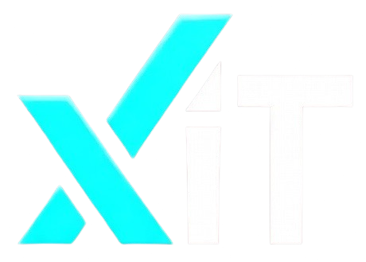

  

#  xIT Video Studio

xIT is an AI-powered video editing application built with Electron, React, and Remotion. It leverages local FFmpeg processing and AI services (Gemini, OpenAI, Fal.ai) to provide a powerful video creation workflow.

## Features

-   **AI Video Editing:** Use natural language prompts to edit videos.
-   **Remotion Integration:** Render high-quality motion graphics and animations.
-   **Local Processing:** Uses a local FFmpeg server for fast asset management and rendering.
-   **AI Transcription:** Automatic captions and transcript-based editing.
-   **Generative AI:** Create B-roll, images, and videos using AI models.

## Getting Started

xIT is distributed as a standalone Windows application.

1.  **Download the Installer:** Get the latest `.exe` installer from the releases page.
2.  **Install:** Run the setup file to install xIT Video Studio on your system.
3.  **Launch:** Open xIT from your desktop or start menu.

## Architecture

*   **Frontend:** React 19, TailwindCSS, Vite.
*   **Backend/Processing:** Local Node.js server (`scripts/local-ffmpeg-server.js`) spawning FFmpeg processes.
*   **Rendering:** Remotion for programmatic video creation.
*   **Wrapper:** Electron for desktop integration.

---

*For development instructions and build commands, please refer to [CLAUDE.md](CLAUDE.md).*
