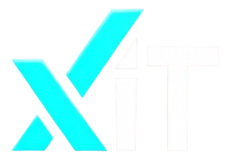
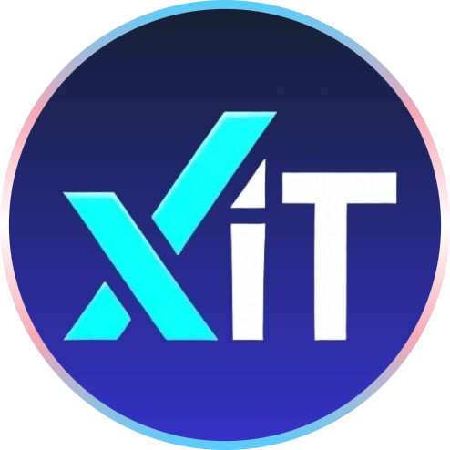

  

#  xIT Video Studio

xIT is an AI-powered video editing application built with Electron, React, and Remotion. It leverages local FFmpeg processing and AI services (Gemini, OpenAI, Fal.ai) to provide a powerful video creation workflow.

## Features

-   **AI Video Editing:** Use natural language prompts to edit videos.
-   **Remotion Integration:** Render high-quality motion graphics and animations.
-   **Local Processing:** Uses a local FFmpeg server for fast asset management and rendering.
-   **AI Transcription:** Automatic captions and transcript-based editing.
-   **Generative AI:** Create B-roll, images, and videos using AI models.

## Getting Started

xIT is a standalone portable Windows application. No installation is required.

1.  **Download:** Get the latest `.exe` from the releases page.
2.  **Launch:** Double-click the `xIT.exe` file to start xIT Video Studio immediately.

## Architecture

*   **Smart Assistant Routing:** Uses context-aware heuristics (e.g., active timeline tab, selected assets) combined with intent parsing to dynamically route natural language prompts to specific editing workflows (like Remotion animations vs. FFmpeg video manipulation).
*   **Frontend:** React 19, TailwindCSS, Vite.
*   **Backend/Processing:** Local Node.js server (`scripts/local-ffmpeg-server.js`) spawning FFmpeg processes.
*   **Session Management:** To prevent race conditions during bulk file uploads (e.g., drag-and-drop), the client uses a shared promise acting as a singleton for session creation (`/session/create`). This ensures concurrent upload requests all bind to a single active backend session, avoiding orphaned processing state.
*   **Auto-Reframe (Face Tracking):** A hybrid architecture utilizing Python with `mediapipe` (via the local Node server) for tracking data, combined with mathematically derived client-side CSS transforms to dynamically keep the subject centered when exporting 16:9 content to 9:16 vertical formats without black bars.
*   **Rendering:** Remotion for programmatic video creation.
*   **Wrapper:** Electron for desktop integration.

---

*For development instructions and build commands, please refer to [CLAUDE.md](CLAUDE.md).*
